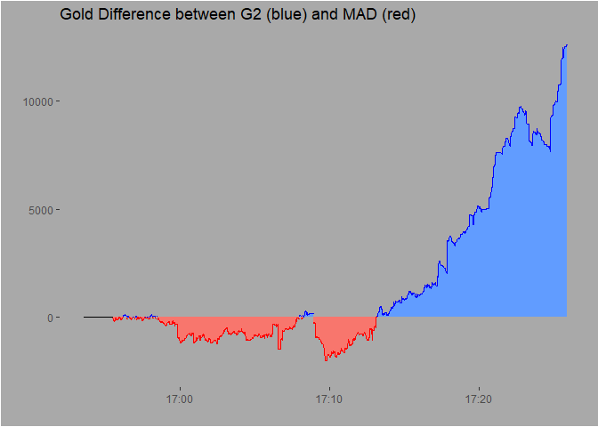

<!-- README.md is generated from README.Rmd. Please edit that file -->

# rlolesports

<!-- badges: start -->
<!-- badges: end -->

The goal of rlolesports is to enable easy queries of the unofficial Riot
Games Esports API for League of Legends. It is very much a package in
development, not yet tested extensively.

The package offers very much opinionated data processing of the original
JSON returns of the API. Thus, every user-facing function has a variable
`save_details`, which can be set to `TRUE` to return the original and
unparsed query result. Without the flag, functions are built to return
lists or data.frames for easy processing in the `dplyr` universe.

## Installation

You can install the current version from [GitHub](https://github.com/)
with:

``` r
# install.packages("remotes")
remotes::install_github("flsck/rlolesports")
```

## Example

First, we use `getLeagues()` without any parameter to create a list of
leagues for which data can be queried.

``` r
library(rlolesports)

leagues <- getLeagues()

# head(leagues[,1:4], 10)
```

We’ll try to get some data for a match played in the LEC, so we’ll
filter the data.frame of leagues and find the ID of the LEC. (Of course,
there are many ways to achieve this. Below is just a `dplyr` way.)

``` r
# Extract the ID of the LEC
lec_id <- leagues %>%
  dplyr::filter(name == "LEC") %>%
  dplyr::select(id) %>% 
  purrr::pluck(1)

# print(paste0("The ID of the LEC is: ", lec_id))
```

To get a bit ahead of myself: The function
`getTournamentsForLeague(...)` returns all available splits or general
tournaments for a given league. The ids gathered by this function
however are NOT used when finding a leagues’s schedule, that the
leagueId’s job, which we already have! The query below will help us
later - because it allows us to find the starting date of a specific
split.

``` r
# Get the ID and dates for tournaments in the LEC
tourney <- getTournamentsForLeague(leagueId = lec_id)
# head(tourney)

# Extract the ID of the 2021 spring split of the LEC
lec_spring_id <- tourney %>%
  dplyr::filter(slug == "lec_2021_split1") %>%
  dplyr::select(id) %>% dplyr::pull(1)
```

This gives us the available schedule for all of LEC. This is not
optimal, because we now need to filter this schedule by the column
`startTime`, where we need to find a specific condition by ourselves. We
utilize the `tourney` data.frame from above to find the starting date of
the LEC 2021 spring split.

``` r
lec_schedule <- getSchedule(lec_id)
#> Getting page  2 
#> Getting page  3

# So we grab the respective date from our tournament data.frame! 
spring_starting_date <- dplyr::filter(tourney, id == lec_spring_id) %>% 
  dplyr::select(startDate) %>% 
  purrr::pluck(1) 

# ... and filter the schedule based on the matches starting times! 
lec_spring_schedule <- 
  dplyr::filter(lec_schedule, as.Date(startTime) >= spring_starting_date)

# head(lec_spring_schedule)
```

Next, we juggle some IDs - match and game IDs, to be precise. To get
details of a game, such as Gold, CS, kills, etc. we need the `gameId`.
The schedule above however returns a `matchId`, which *contains*
different `gameId` entries. To illustrate this further, think about a
best-of-5 series between G2 and MAD Lions. The series itself is one
match with one `matchId`. The games within that series however all have
different `gameId` variables, which we would use to get more details
about one specific game in the series.

Below, we will just grab the `gameId` of the best-of-1 match between G2
and MAD that opened the 2021 LEC spring split.

``` r
# Next, we get the ID of the opening match, the first row in the data.frame!
opening_match <- lec_spring_schedule$match.id[1]

# but the matchId is not the gameId we need for detailed queries of match details, 
# which is why we need to grab details of the match, where the respective gameId is saved.
opening_details <- getEventDetails(opening_match)

opening_game_id <- opening_details$games$game_id[1]
```

With the `gameId` as a variable, we can get detailed information about
the match by calling `getCompleteWindow()`.

``` r
g2_vs_mad <- getCompleteWindow(opening_game_id)
#> [1] "Game done, duration: 1.334mins"
# print(g2_vs_mad$data[2500:2510,])
```

That’s it. Now we have data for the game and could analyze, for example,
the time series of totalGold.

``` r
# Since the data.frame returns one row per team member per team, we need to extract just 
# one row for a given timestamp and team for the aggregated statistics, like totalGold and 
# totalKills. 
library(dplyr, verbose=FALSE)

plot_df <- g2_vs_mad$data %>% 
  group_by(timestamp, team) %>% 
  select(totalGold, totalKills, timestamp, team) %>% 
  slice_head() %>% 
  arrange(timestamp) %>% 
  distinct(timestamp, team, .keep_all = TRUE) %>% 
  ungroup()

plot_df <- plot_df %>% 
  select(timestamp, totalGold, team) %>% 
  tidyr::pivot_wider(names_from = team, values_from = totalGold) %>% 
  mutate(blue_diff = as.double(blue - red),
         blue_lead = as.factor(sign(blue_diff)),
         y_min = if_else(blue_diff > 0, 0, blue_diff),
         y_max = if_else(blue_diff > 0, blue_diff, 0),
         timestamp = lubridate::ymd_hms(timestamp)) %>% 
  distinct(timestamp, .keep_all = TRUE) %>% 
  tidyr::complete(blue_lead, timestamp, fill = list(blue_diff = 0))

library(ggplot2, verbose=FALSE)

plot_df %>% 
  ggplot(aes(x = timestamp, y = blue_diff, color = blue_lead)) +
  geom_ribbon(data = filter(plot_df, blue_diff <= 0),
    aes(ymax = y_max, ymin = y_min, fill = blue_lead, color = blue_lead),
    outline.type = "lower"
    ) +
  geom_ribbon(data = filter(plot_df, blue_diff >= 0),
    aes(ymax = y_max, ymin = y_min, fill = blue_lead, color = blue_lead),
    outline.type = "upper"
    ) +
  scale_color_manual(values = c("red", "black", "blue")) +
  ylim(c(-2500, max(plot_df$blue_diff))) + 
  xlab("") + ylab("") + 
  ggtitle("Gold Difference between G2 (blue) and MAD (red)") +
  theme(legend.position = "none",
        panel.background = element_rect(fill = "darkgrey"),
        plot.background = element_rect(fill = "darkgrey"),
        panel.grid = element_line(colour = "darkgrey"),
        title = element_text())
```


